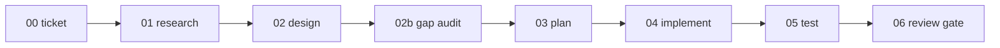

# tms-pipeline

**An opinionated delivery pipeline for AI coding agents (Claude Code & Codex).**
Eight staged skills take an already-defined task from ticket to reviewed code — with a severity-rated
design audit, a cost model for spawning agents, and a hard rule that discovered work is never lost.

🇷🇺 [Читать по-русски](README.ru.md) · 📖 [Full methodology](docs/00-methodology.md) · 🚀 [Getting started](docs/01-getting-started.md)

---

## What this is — and what it is NOT

**It is** a *delivery* methodology: a disciplined process for moving a single, already-defined task from
"we should do X" to mergeable, reviewed code, while keeping the AI agent's context clean at every step.

**It is NOT:**

- ❌ a project generator — it does not scaffold an app from nothing;
- ❌ a feature brainstorm — deciding *what* to build is your job, done your way; the pipeline starts once a
  task exists;
- ❌ a magic "build my product" button.

**Prerequisites.** You should already have: a real code repository, a documentation base (a docs tree, a
wiki, an Obsidian vault — anywhere durable knowledge lives), and ideally a backlog of tasks. The included
blank skeletons give you a starting structure, but filling them with real product decisions is your work.

---

## Haven't started the project yet? Bootstrap first

tms-pipeline expects a documentation base and a backlog to already exist — it delivers tasks, it doesn't
invent the product. If you're starting from nothing, do this **one-time bootstrap** first to reach the
starting line. This is a manual pre-step, not a pipeline stage and not an automated brainstorm — you
drive it.

Open your agent (Claude Code or Codex) in the repo and use a prompt like this:

> Let's create the product spec for **<product>**. The idea is **<core idea>**; the goal is
> **<outcome>**.
> Interview me **one question at a time**, each with 2–3 concrete options, and **mark the recommended
> option** clearly. I'll answer each; when you have no more questions, produce a `PRD.md`.
> Then distribute every decision from my answers into the matching folders of the tms-pipeline
> documentation-base template (`00 Governance/`, `02 Product/`, `03 Architecture/`, `04 Delivery/`),
> and keep all of it **in sync with my documentation vault** as the single source of truth.

What this gives you:

- A real **PRD** plus the rest of the doc base, filled from your own decisions — not the agent's guesses.
- One question at a time with a **recommended answer highlighted**, so you can move fast by accepting
  defaults or pushing back.
- Every output **sorted into the doc-vault template folders** (copy `templates/docs-vault/PROJECT_NAME/`
  into your vault first — see [docs/03-doc-base.md](docs/03-doc-base.md)), and kept **synchronized with
  that vault**, which becomes your single source of truth.

Once you have a doc base and at least one backlog item, run `npx tms-pipeline` and start the pipeline
normally (below).

---

## Why it exists: context engineering

Generic prompts ("build this feature, no bugs") don't scale — a single mega-prompt fills with noise and
the output degrades into complexity, bugs, and security holes. The fix is **strict decomposition**: split
the work into stages, and make each stage's output the narrow, noise-free context for the next. At every
step the agent gets exactly what it needs and is constrained by your project's standards. Quality comes
from context control, not model magic.

→ Read the full reasoning in [docs/00-methodology.md](docs/00-methodology.md).

---

## The eight stages

```
00_ticket → 01_research → 02_design → 02b_gap_audit → 03_delivery_plan → 04_implementation → 05_test_report → 06_review_gate
```



Each stage produces one durable file in the task folder and, by default, stops for your confirmation
before the next. There is **no** brainstorm/ideation stage — the pipeline begins once a task exists.

| Stage | Skill | What it does |
|-------|-------|--------------|
| 00 Ticket | `/tms-ticket` | Driver, scope, acceptance; confirm the task; classify task mode. |
| 01 Research | `/tms-research` | Narrow the codebase to facts ("as-is") via a bounded parallel search. |
| 02 Design | `/tms-design` | The single design contract — minimal sufficient change, reviewed before code. |
| 02b Gap audit | `/tms-gap-audit` | One bounded adversarial pass over the design, severity-rated. |
| 03 Plan | `/tms-plan` | Split into small shippable waves; tag each with an escort profile. |
| 04 Implement | `/tms-implement` | Multi-agent "mob": lead + worker/proving agents, gated wave by wave. |
| 05 Test | `/tms-test` | Validate the primary (user-visible) signal + secondary signals. |
| 06 Review gate | `/tms-review` | Verify vs the design contract; go / conditional_go / no-go. |

Plus extra skills for codebase work: a four-stage **audit** pipeline (`/tms-audit-scope` →
`sweep` → `triage` → `backlog`), maintenance **refactoring** (`/tms-care-refactoring`,
`/tms-ui-refactoring`), and an iterative **review loop** (`/tms-loop-code-review`).

---

## Three things most agent pipelines don't have

1. **Severity-rated gap audit.** Before any code, the design is audited from a *different* reasoning lens
   than it was written with, and each gap is classified A/B/C/D with explicit anti-inflation rules and
   stopping criteria. Wrong designs get fixed in text, not in code.
2. **A cost model for agents — escort profiles.** Every implementation wave is classified A (minimal:
   Dev+Tester+Reviewer), B (+Architect), or C (+Security). Full escort is reserved for genuinely risky
   surfaces (auth, tenancy, payments, PII…) that *you* define. Heavy review only where it pays off —
   "run everything to be safe" is explicitly discouraged.
3. **Nothing discovered gets lost.** Follow-ups, doc drift, and manual pre-launch actions are captured by
   a hard rule with a routing table (backlog / source doc / launch playbook / ADR), and the backlog is
   kept usable with a *bundle-don't-shard* discipline.

→ Details in [docs/00-methodology.md](docs/00-methodology.md).

## Process proportional to the task

Heavyweight pipelines tend to drown a one-line change in ceremony. tms-pipeline classifies every task
first — **Direct** (cosmetic), **Investigation** (root cause unclear), or **TDD-first** (real behavior) —
so the full machinery only kicks in for substantial work.

---

## Two ways to adopt it

| | Turnkey | Methodology |
|---|---|---|
| For | Getting running fast | Understanding & wiring it by hand |
| How | `npx tms-pipeline` wizard + `/plugin install` | Read the docs, install skills, write `AGENTS.md` yourself |

Both are free and open-source and share the same core.

---

## Install

The skills and methodology work on **both Claude Code and Codex**. The onboarding wizard asks which
tool(s) you use and writes only what you need (e.g. no `.claude/CLAUDE.md` if you only use Codex).

```bash
# 1) Configure the methodology onto YOUR existing project (short y/n wizard; asks Claude/Codex)
npx tms-pipeline
```

```text
# 2a) Claude Code — install the skills + agents
/plugin marketplace add TmsNine/tms-pipeline
/plugin install tms-pipeline@tms-pipeline
/reload-plugins

# 2b) Codex — reads AGENTS.md natively; install the skills/agents for Codex
#     (see docs/02-configuration.md#codex)
```

---

## Tutorial — how to actually use it

### Step 1 — Onboard your project

Run `npx tms-pipeline` (or `/tms-init` inside Claude Code) and answer the short question list (press
Enter to accept each default). It writes a filled `AGENTS.md` and `.claude/CLAUDE.md` into your project,
and can copy the pipeline + doc-base skeletons.

### Step 2 — One-time configuration

Open the generated `AGENTS.md` and:

- resolve any `<<TODO: ...>>` markers — most importantly **`PROFILE_C_TRIGGERS`** (which surfaces force
  full security escort) and your tenancy/identity model;
- if you copied the doc-base skeletons, **rename the `PROJECT_NAME` folder** to your project and point
  `DOC_BASE_PATH` at it.

→ Reference: [docs/02-configuration.md](docs/02-configuration.md).

### Step 3 — Run one task through the pipeline

Pick a task from your backlog and walk the stages. The agent does one stage, then stops for your OK:

```text
/tms-ticket    ACME-123     → writes 00_ticket.md   (driver, scope, acceptance, task mode)
/tms-research  ACME-123     → writes 01_research.md  (the facts; may ask you an interview)
/tms-design    ACME-123     → writes 02_design.md    (the design contract — you review it)
/tms-gap-audit ACME-123     → writes 02b_gap_audit.md (A/B/C/D gaps; Class A fixed into the design)
/tms-plan      ACME-123     → writes 03_delivery_plan.md (waves + escort profiles)
/tms-implement ACME-123     → writes 04_implementation.md (multi-agent mob, gated per wave)
/tms-test      ACME-123     → writes 05_test_report.md (primary + secondary signals)
/tms-review    ACME-123     → writes 06_review_gate.md (go / conditional_go / no-go)
```

After each stage a file appears in your task folder (`docs/ACME-123/`). Read it, confirm or correct, then
run the next stage.

> **Start each stage in a clean context window.** This is the whole point of context engineering — the
> next stage should receive only its predecessor's artifact, not the accumulated noise of the previous
> conversation. Each stage skill ends by reminding you to do this. Before running the next stage:
> **Claude Code** → `/clear`; **Codex** → `/clear` (or `/new`). Then run the next `/tms-*` command.

Ask the agent to "run end-to-end" only for small tasks where keeping one context is cheaper than the gain
from clearing.

### Step 4 — Where things land

- Code changes: in your repo, committed (no AI attribution, not auto-pushed — your branch waits for review/CI).
- Follow-ups: new backlog rows (bundled).
- Manual launch steps: your launch playbook.

### FAQ

- **Do I need both Claude Code and Codex?** No — either works. Skills are portable; Codex reads `AGENTS.md`
  natively.
- **Can I skip stages?** For small tasks, yes — the task mode (Direct/Investigation) trims the process,
  and the gap audit can be marked "skipped per minimal-surface exception".
- **It made the design wrong — now what?** That's the point of stage 02/02b: fix it in the text and
  re-run. Cheap to fix before code exists.
- **Does it brainstorm features for me?** No. Bring your own task; this delivers it.

---

## Repository layout

```
skills/        15 tms-* skills (the pipeline + audit + refactoring)
agents/        5 mob roles (developer, tester, architect, security, reviewer)
commands/      /tms-init onboarding command
installer/     core config engine + the `npx tms-pipeline` wizard
templates/     AGENTS/CLAUDE templates, pipeline forms, doc-base skeletons
docs/          the full methodology + getting-started + configuration + doc-base
```

---

## Credits & sources

This project synthesizes and builds on the work of others:

- **Core single-task methodology** — adapted from the video
  ["Почему AI генерит мусор — и как заставить его писать нормальный код"](https://youtu.be/7oRBHxMvWxQ)
  by **Dmitry Bereznitsky (Дмитрий Березницкий)**, which lays out the context-engineering, four-phase (research → design →
  planning → implementation) workflow with mob programming and quality gates.
- **The four-stage codebase-audit pipeline** (`/tms-audit-scope` → `sweep` → `triage` → `backlog`) —
  adapted from ideas shared by [di.sukharev](https://www.instagram.com/di.sukharev/) and reworked into
  skills here.
- **The `AGENTS.md` canon** — parts draw on the `AGENTS.md` format and conventions by
  **Boris Cherny**.

Everything else (the eight-stage extension, the severity-rated gap audit, the escort cost profiles, the
follow-up/launch capture, and the packaging) is original to this project.

## License

[Apache-2.0](LICENSE). Free to use and adapt. Treat the methodology as a living process — adjust the
stage names, escort triggers, and prompts to your team's culture; the principle that matters is
controlling the context at every step.
