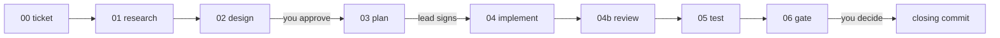

```text
████████╗███╗   ███╗███████╗
╚══██╔══╝████╗ ████║██╔════╝
   ██║   ██╔████╔██║███████╗
   ██║   ██║╚██╔╝██║╚════██║
   ██║   ██║ ╚═╝ ██║███████║
   ╚═╝   ╚═╝     ╚═╝╚══════╝
```

# tms-pipeline

**tms-pipeline is a discipline for AI agents: it takes one already-defined task from a ticket to reviewed code, keeping the agent's context clean at every step.**
The work is split into eight stages. Each stage runs in its own fresh context and leaves one document behind
(each stage is a *skill* — a command you give the agent, for example `/tms-01-research`). One more skill,
`/tms-run`, carries a task through all eight stages for you. The pipeline stops for you twice — after the
design and at the final gate — and never decides on your behalf (this is the "human in the loop" principle).

🇷🇺 [Читать по-русски](README.ru.md) · 📖 [Full methodology](docs/00-methodology.md) · 🚀 [Getting started](docs/01-getting-started.md) · 🧭 [Model routing](docs/06-model-routing.md)

---

## In short

- **What it is.** An eight-stage process that takes **one already-defined** task from a ticket to reviewed
  code. The core idea: at each stage the agent holds in mind only what it needs right now.
  (The agent has a limited working memory — its *context window*; the more clutter in it, the worse the answer.)
- **The real work is thinking on paper.** Every stage leaves a text document (`.md`). Code is written only
  in stage 04, after the design is approved and the plan is signed. Mistakes get caught in text, where
  fixing them costs a sentence.
- **You stay in charge at two points.** You read and approve the **design** (stage 02) and you make the
  **final decision** at the gate (stage 06). In between, the agents work on their own: the plan is checked
  by a fresh reader and signed by the lead agent, the code is reviewed by independent reviewers who never
  saw the author's conversation. Silence is never taken as a yes.
- **What it isn't.** It does not generate a product, invent features for you, or act as a "magic button."
- **One command.** `npx tms-pipeline` sets the process up on top of your **existing** repo.
- **See it live.** [A full task run through the pipeline →](templates/example-task/ACME-101/) — a synthetic
  task from `00_ticket.md` to `06_review_gate.md`, so you can see each stage's format before you start.
- **Under the hood.** [How each stage works: which agents, on which models, and why →](docs/04-stages-deep-dive.md)

---

## What this is — and what it is NOT

**It is** a process for taking one task all the way to finished code: it picks up an already-defined task
("we need to do X") and carries it to reviewed code you can merge into the main branch, keeping the AI
agent's working memory (context) clean at every step.

**It is NOT:**

- ❌ a project generator — it does not build an app from nothing;
- ❌ a feature brainstorm — deciding *what* to build is your call, made your way; the process starts once a
  task exists;
- ❌ a magic "build my product" button.

**Prerequisites.** You should already have: a real code repository, a documentation base (a docs tree, a
wiki, or an Obsidian vault — anywhere durable knowledge about your product lives, as long as it's a stable
home for it) and, ideally, a backlog — a list of future tasks. The included blank templates give you a
starting structure, but filling them with real product decisions is your job.

---

## No documentation base yet? Do the one-time setup first

tms-pipeline expects you to already have a documentation base and at least one task in the backlog — it
takes defined tasks to code, it doesn't invent the product. If you're starting from nothing, do this
**one-time initial setup** to reach the starting line. This is a one-off setup activity, not one of the eight stages
of the process and not an automated brainstorm: you define the product; the agent only asks questions and
sorts your answers into documents.

How to tell whether you need this step: **no documentation base or tasks yet → do the setup (below). You
already have them → skip this section** and go straight to Install.

The simplest path is the **`/tms-new`** skill (recall: a *skill* is a command like `/tms-new` that you give
the agent). It runs this setup for you as an interview (one question at a time, each with a recommended
option) and, at the end, creates a starter document set and folder structure. Prefer to do it by hand? Use
the prompt below:

> Let's define the **MVP documentation** for the product **<product>**. The idea is **<core idea>**; the
> goal is **<outcome>**.
> Ask me questions **one at a time**, each with 2–3 concrete options, and **mark the recommended option**.
> I'll answer; when you have no more questions, produce an **initial MVP documentation set** — only what's
> already decided, meant to be filled in further as development progresses.
> Sort every decision from my answers into the folders of the tms-pipeline documentation-base template
> (`00 Governance/`, `02 Product/`, `03 Architecture/`, `04 Delivery/`), and keep the whole codebase and
> documentation **in sync with my vault documentation** as the single source of truth.

What this gives you:

- An **initial MVP documentation set** filled with your decisions, not the agent's guesses. It's a living
  foundation: you grow it as development progresses, not a one-off document.
- Questions **one at a time, with the recommended answer highlighted** — so you can move fast by accepting
  the defaults or pushing back.
- Every result **sorted into the documentation-base template folders** (first copy
  `templates/docs-vault/PROJECT_NAME/` into your documentation base — see
  [docs/03-doc-base.md](docs/03-doc-base.md)) and **kept in sync with it**. This base becomes the main
  document everything else is later checked against.

Once you have this baseline doc set and at least one task in the backlog, run `npx tms-pipeline` and start
the process as usual (below). From then on, the documentation base keeps growing: **after each task is
done, its result and decisions are folded back into the right documents**, so the base always reflects what
was actually built (see [Documentation Discipline](docs/00-methodology.md) and the review gate).

---

## Why it exists: context control

Generic prompts ("build the feature, no bugs") don't scale. When everything is dumped into one prompt — the
description, the chat history, the requirements, past attempts — the agent gets confused, loses the early
instructions, and writes buggy code. The more clutter in its working memory (context), the worse the result.

The fix is to **split the work into steps** and make each step's output a narrow input for the next one,
stripped of everything irrelevant. At each step the agent gets exactly what it needs and is bound by your
project's standards. Quality depends on how clean a context the agent gets at each step.

→ Full reasoning: [docs/00-methodology.md](docs/00-methodology.md).

---

## The eight stages

```
00_ticket → 01_research → 02_design → 03_plan → 04_implementation → 04b_review → 05_test_report → 06_review_gate
```


```mermaid
flowchart LR
  T["00 ticket"] --> R["01 research"] --> D["02 design"]
  D -->|"you approve"| P["03 plan"]
  P -->|"lead signs"| I["04 implement"] --> L["04b review"] --> TE["05 test"] --> G["06 gate"]
  G -->|"you decide"| Done["closing commit"]
```

Each stage creates one document in the task folder (`docs/<TASK-ID>/`) and runs in a **fresh context**: it
gets the previous documents, never the previous conversation. A stage that inherits the reasoning of the one
before it inherits its blind spots — so this is the one rule the whole process protects. There is **no**
brainstorm/ideation stage — the process starts once a task exists.

| Stage | Skill | What it does | Who stops |
|-------|-------|--------------|-----------|
| 00 Ticket | `/tms-00-ticket` | Writes down the problem in one sentence from the user's side, who it affects and what is out of scope. Only you decide that a task exists. | — |
| 01 Research | `/tms-01-research` | Collects the facts, with exact files and lines, and no opinions. Separates "checked and absent" from "not found by search", and lists countable things one row per item. | — |
| 02 Design | `/tms-02-design` | Chooses the solution: the layer that owns the behaviour, before → after as the user sees it, a test for every behaviour, a rollback. If two choices would change what users see, it asks you one question first. | **You read and approve** |
| 03 Plan | `/tms-03-plan` | Cuts the work into small phases with an exact list of files (File Ownership — nothing outside it gets written), a map of the seams between phases, a runnable check for every phase, and a precise failing-test spec. A fresh reader checks the plan against itself. | The lead agent signs |
| 04 Implement | `/tms-04-implement` | One agent writes the whole plan, test first, phase by phase, then checks every seam end to end. If the change touches security, money, tenants or personal data, one security reviewer looks at the whole change. | — |
| 04b Review | `/tms-04b-review` | Up to five fresh, independent reviewers in turn; one of them always proves the whole path works end to end. Only a real, user-visible defect blocks; every other finding is fixed, proposed for the backlog, parked with a named trigger, or dropped with a reason. | — |
| 05 Test | `/tms-05-test` | Runs every check from the plan and reports what each one returned — the user-visible signal first, the code checks second, and what was not run. | — |
| 06 Gate | `/tms-06-gate` | One page for the decision: proof the task works, acceptance row by row, what review did, what is left for a person. **Only you write `go`.** The lead may sign `conditional_go` when only a live check or a rollout step is left. | **You decide** |

→ What exactly happens in each stage (which agents, on which models, where your check is) — in the
[under-the-hood stage walkthrough](docs/04-stages-deep-dive.md).

Plus extra skills: **`/tms-run`** (the orchestrator — carries one task through all eight stages and stops
at your two checkpoints), **`/tms-ui-screen`** (one screen through design-system reuse, interactive QA,
review and your visual approval — a task that changes a screen uses it instead of stage 04), a four-step
codebase **audit** (`/tms-audit-scope` → `sweep` → `triage` → `backlog`), maintenance **refactoring**
(`/tms-care-refactoring`, `/tms-ui-refactoring`), and **`/tms-new`** for a product that starts from nothing.

---

## Things most agent processes don't have

1. **A fresh context for every stage, and briefs without opinions.** The orchestrator hands each stage the
   paths to its input documents and your exact words — never its own theory of the problem. An agent handed
   a hypothesis returns it confirmed; a fresh one checks it.
2. **One author for the code, independent eyes for the review.** Splitting one chain of work between many
   agents loses what lives between their pieces, and coordination costs more than the work. So one agent
   writes the whole plan, and independence comes where it matters: reviewers who never saw the author's
   conversation, a security pass when a real trigger fires, and an end-to-end pass that must prove the
   feature actually reaches the user.
3. **Review that ends.** A reviewer can always find one more edge case. Here a finding blocks only if it can
   be reproduced on the current code **and** a user would notice it; everything else gets a route — fixed
   now, one backlog line for you to accept or decline, a trigger register entry ("matters when X happens"),
   or dropped with a reason. At most five passes, and the loop stops early when it stagnates.
4. **Nothing found gets lost.** Follow-ups, documentation drift and manual pre-launch steps are captured by a
   hard rule: to the backlog, to the source document, or to the launch playbook (the list of manual steps
   before a rollout). The backlog itself is kept in order by a "bundle findings, don't shard them" rule.
5. **Model and effort are pinned per role.** Each agent role declares its model and reasoning effort, so you
   never switch models by hand: deep judgement (design, review, security) on the strongest model at high
   effort, routine assembly and search on a cheaper one.

→ Details: [docs/00-methodology.md](docs/00-methodology.md) · [docs/06-model-routing.md](docs/06-model-routing.md).

## The process is sized to the task

In heavyweight processes, a one-line change gets buried in needless ceremony. Here the agent first sets the
task mode — **Direct** (cosmetic, a small fix), **Investigation** (the cause of the problem is still
unclear), or **TDD-first** (real behavior changes, so you write a failing test first, then write code until
the test passes). The full heavy machinery only kicks in for substantial work.

---

## Two ways to adopt it

The result is the same — the only difference is how much you do by hand.

- **Turnkey — right for most people.** Run `npx tms-pipeline` (a terminal program, not an agent): it
  installs the skills and drops a starter `AGENTS.md`; then `/tms-init` inside your agent reads the repo and
  fills it in. `AGENTS.md` is your project's settings file, which the agents read to learn
  your rules. Take this path if you want to start working today without digging into how it's built.
- **Manual — if you want control.** Read the methodology, install the skills, and write `AGENTS.md`
  yourself. Take this path if you want to understand every detail and tune the process for your team.

---

## Install

Claude Code and Codex are two AI tools (the programs the agents run inside). The skills and the whole
process work in both; you need only one of the two. The installer asks which tool(s) you use and writes
only what's needed (for example, it won't create `.claude/CLAUDE.md` if you only use Codex).

```bash
# 1) Set the process up ON YOUR existing project (short y/n wizard; asks about Claude/Codex)
npx tms-pipeline

#    Until the npm package is published, run it straight from GitHub:
npx github:TmsNine/tms-pipeline

#    Preview without writing anything:   npx tms-pipeline --dry-run
```

```text
# 2a) Claude Code — install the skills + agents. Two ways, pick ONE (to avoid duplicates).
#   (a) via the plugin marketplace:
/plugin marketplace add TmsNine/tms-pipeline
/plugin install tms-pipeline@tms-pipeline
/reload-plugins
#   (b) or let the installer copy them in: answer "yes" to "Install the tms-* skill files now"
#       → skills/agents/commands land in ~/.claude, then restart Claude Code.

# 2b) Codex — reads AGENTS.md natively. Codex has no /plugin install equivalent, so its skills/agents
#     go in ~/.codex. The installer copies them when you select Codex. By hand:
#       cp -R codex-skills/* ~/.codex/skills/ && cp -R codex-agents/* ~/.codex/agents/
#     More: docs/02-configuration.md#codex
```

> The installer installs only what you select and never overwrites an existing file unless you pass
> `--force`. **Upgrading from 0.1.x?** It also never deletes anything, so remove the retired skill folders
> (`tms-ticket`, `tms-research`, `tms-design`, `tms-gap-audit`, `tms-plan`, `tms-implement`,
> `tms-loop-review`, `tms-loop-code-review`, `tms-review`, `tms-test`, and in Codex `tms-02b-gap-audit`,
> `tms-04b-loop-review`, `tms-06-review`, `tms-94-loop-code-review`) from `~/.claude/skills` and
> `~/.codex/skills` by hand — see [CHANGELOG.md](CHANGELOG.md).

---

## Tutorial — how to actually use it

### Step 1 — Onboard your project

Run `npx tms-pipeline`, then `/tms-init` inside Claude Code or Codex. The installer drops a starter
`AGENTS.md` (your project's settings file, which the agents read to learn your rules); `/tms-init` reads your
repository and fills it — test and build commands, paths, ticket format — asking you only about what it
cannot find.

### Step 2 — One-time configuration

Open the generated `AGENTS.md` and resolve the remaining `<<TODO: ...>>` markers — first of all:

- **`SECURITY_TRIGGERS`** — which parts of the code (sign-in, roles, tenant data, money, personal data)
  should trigger the security pass in stage 04 and the strongest reviewer in 04b;
- **`TASK_CHECK_CMD`** — one command that builds, type-checks and tests everything a task touched;
- the **known-test-debt register** (tests already red on the main branch) and the **trigger register**
  (findings that matter only when a named event happens);
- if you copied the blank documentation-base templates, **rename the `PROJECT_NAME` folder** and put the
  path in `DOC_BASE_PATH`.

> **Not sure what to put in a `<<TODO>>`?** Don't guess alone: ask your AI agent to read your code and
> propose values, then confirm or correct them — [docs/05-manual-setup.md](docs/05-manual-setup.md) has
> ready-to-paste prompts.

→ Reference: [docs/02-configuration.md](docs/02-configuration.md).

### Step 3 — Run one task through the process

The simplest way: let the orchestrator carry it.

```text
/tms-run ACME-123
```

It runs each stage as its own agent with a fresh context and stops twice:

1. **After `02_design.md`** — read the design and approve it (or ask for changes). If a choice would change
   what users see, you get one plain-language question with a recommended answer before the design is
   finished.
2. **At `06_review_gate.md`** — read one page and decide: `go`, "fix first", or "not now". If only a live
   check or a rollout step is left, the lead signs `conditional_go` and writes that step into your launch
   playbook.

Prefer to drive it by hand? Run the stages one by one, each in a clean context window (**Claude Code** →
`/clear`; **Codex** → `/clear` or `/new` before the next command):

```text
/tms-00-ticket     ACME-123  → 00_ticket.md          (the problem, who, out of scope)
/tms-01-research   ACME-123  → 01_research.md        (facts only)
/tms-02-design     ACME-123  → 02_design.md          (you approve)
/tms-03-plan       ACME-123  → 03_plan.md            (phases, File Ownership, checks — lead signs)
/tms-04-implement  ACME-123  → 04_implementation.md  (code, test first)
/tms-04b-review    ACME-123  → 04b_review.md         (independent review loop)
/tms-05-test       ACME-123  → 05_test_report.md     (every check, with exit codes)
/tms-06-gate       ACME-123  → 06_review_gate.md     (you decide)
```

### Step 4 — Where things land

- Code changes: in your repo, as one closing commit per task after the gate (no AI listed as the author,
  never pushed automatically).
- Follow-ups you approved at the gate: new backlog rows, grouped into bundles.
- Findings that matter only later: the trigger register.
- Manual pre-launch steps and `conditional_go` conditions: your launch playbook.

### FAQ

- **Do I need both Claude Code and Codex?** No — either one works. Skills are portable; Codex reads
  `AGENTS.md` natively.
- **Can I skip stages?** No — every task goes through all eight, but a small task fills them in a few
  lines each. Sections are fixed; length is free.
- **The design came out wrong — what do I do?** Say so at the design stop. The change lands in the design
  document and the plan is written from the corrected version. It's cheap while no code exists yet.
- **What if the agent needs to touch a file that isn't in the plan?** It stops and asks you. File Ownership
  is the boundary of implementation.
- **Will it invent features for me?** No. Bring your own task; the process takes it to code.

---

## Repository layout

```
skills/        Claude Code tms-* skills (8 stages + tms-run + tms-ui-screen + audit + refactoring + tms-new)
codex-skills/  Codex tms-* skills (same stage skills; audit/refactoring under numbered names)
agents/        9 Claude Code role agents, each pinning its model and effort
codex-agents/  6 Codex TOML role agents
commands/      the /tms-init onboarding command
installer/     the core config engine + the `npx tms-pipeline` installer
templates/     AGENTS/CLAUDE templates, stage document forms, blank documentation-base templates, an example task
docs/          methodology + setup/configuration + stage walkthrough + model routing
```

---

## Sources & credits

This project synthesizes and builds on the work of others:

- **The core single-task methodology** — adapted from the video
  ["Why AI generates garbage — and how to make it write decent code"](https://youtu.be/7oRBHxMvWxQ)
  by **Dmitry Bereznitsky (Дмитрий Березницкий)**, which lays out the context-control approach and the
  four-phase process (research → design → planning → implementation) with a team of agents (a mob) and
  quality gates that the work cannot pass until every check is green.
- **The four-step codebase audit** (`/tms-audit-scope` → `sweep` → `triage` → `backlog`) — adapted from
  ideas by [di.sukharev](https://www.instagram.com/di.sukharev/) and turned into skills here.
- **The `AGENTS.md` canon** — parts draw on the `AGENTS.md` format and conventions by **Boris Cherny**.

- **The 04b review loop** — builds on the `loop-code-review` skill by di-sukharev, with a finding contract
  (blocking vs routed) replacing its verdict and open-ended stop.

Everything else (the eight-stage chain with its two owner stops, the one-executor implementation, the
seam map, the finding routes, the capture of follow-ups and manual pre-launch actions, and the packaging
itself) is original to this project.

## License

[Apache-2.0](LICENSE). Free to use and adapt. Treat the process as a living thing — change the stage names,
the security triggers, and the prompts to fit your team's culture; what matters is the principle: control the
context at every step and put independent review where it checks the real result.
