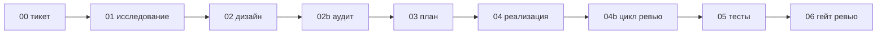

```text
████████╗███╗   ███╗███████╗
╚══██╔══╝████╗ ████║██╔════╝
   ██║   ██╔████╔██║███████╗
   ██║   ██║╚██╔╝██║╚════██║
   ██║   ██║ ╚═╝ ██║███████║
   ╚═╝   ╚═╝     ╚═╝╚══════╝
```

# tms-pipeline

**tms-pipeline — это дисциплина для AI-агентов: она проводит одну уже поставленную задачу от тикета до проверенного кода, держа память агента чистой на каждом шаге.**
Работа разбита на девять долговечных артефактов. Каждую стадию вы запускаете отдельной командой агенту (такая команда здесь
называется *скилл* — например, `/tms-research`). Решение на каждом шаге остаётся за вами: агент делает
один шаг — вы его проверяете, и только потом идёте дальше (это и есть принцип «человек проверяет каждый
шаг», по-английски human in the loop).

🇬🇧 [Read in English](README.md) · 📖 [Полная методология](docs/00-methodology.ru.md) · 🚀 [Старт](docs/01-getting-started.ru.md) · 🧭 [Маршрутизатор моделей](docs/06-model-routing.ru.md)

---

## Если коротко

- **Что это.** Процесс из девяти артефактов, который ведёт **одну уже сформулированную** задачу от тикета до
  проверенного кода. Главная идея — на каждом шаге у агента в работе только то, что нужно именно сейчас.
  (У агента ограниченная рабочая память — *контекстное окно*; чем больше в ней лишнего, тем хуже ответ.)
- **Основная работа — думание на бумаге.** Все девять долговечных артефактов — текстовые документы
  (`.md`). Основное изменение кода пишется рядом с 04 (реализация), а 04b может внести фиксы по итогам
  ревью реального diff. Сначала всё продумывается в тексте, и только потом пишется код.
- **Вы всё время в центре (человек проверяет каждый шаг).** Это не «поставил задачу и ушёл»: после
  каждого шага агент останавливается, вы проверяете, что он сделал, и только потом запускаете следующий.
  Вы не делегируете работу целиком — вы ведёте агента и сверяете каждый шаг.
- **Чего нет.** Не генерирует продукт, не придумывает фичи за вас, не «волшебная кнопка».
- **Одна команда.** `npx tms-pipeline` настраивает процесс поверх вашего **существующего** репозитория.
- **Посмотреть вживую.** [Полный пример прогона задачи через все 9 артефактов →](templates/example-task/ACME-101/)
  — синтетическая задача от `00_ticket.md` до `06_review_gate.md`, чтобы увидеть формат каждого шага до запуска.
- **Что под капотом.** [Как устроен каждый шаг: какие агенты, на каких моделях и зачем →](docs/04-stages-deep-dive.ru.md)

---

## Что это — и чем это НЕ является

**Это** процесс доведения одной задачи до готового кода: он берёт уже сформулированную задачу («нам нужно
сделать X») и проводит её до проверенного кода, который можно вливать в основную ветку, сохраняя рабочую
память (контекст) AI-агента чистой на каждом шаге.

**Это НЕ:**

- ❌ генератор проектов — он не создаёт приложение с нуля;
- ❌ брейншторм фич — что именно строить, решаете вы, как привыкли; процесс начинается, когда задача уже
  есть;
- ❌ волшебная кнопка «сделай мне продукт».

**Предусловия.** У вас уже должно быть: реальный репозиторий с кодом, база документации (дерево docs,
вики или Obsidian-vault — где угодно, лишь бы это было постоянным местом, где живут знания о продукте) и
желательно бэклог — список задач на будущее. Готовые пустые заготовки дают стартовую структуру, но
наполнять их реальными продуктовыми решениями — ваша работа.

---

## Ещё нет базы документации? Сначала разовая подготовка

tms-pipeline рассчитывает, что у вас уже есть база документации и хотя бы одна задача в бэклоге — он
доводит до кода уже поставленные задачи, а не придумывает продукт. Если вы стартуете с нуля, сделайте эту
**разовую первичную подготовку**, чтобы дойти до стартовой линии. Это разовый шаг, а не один из восьми
шагов процесса и не автоматический брейншторм: продукт определяете вы, агент лишь задаёт вопросы и
раскладывает ваши ответы по документам.

Как понять, нужен ли этот шаг: **базы документации и задач ещё нет → делайте подготовку (ниже). Они уже
есть → пропускайте этот раздел** и сразу переходите к установке.

Самый простой путь — скилл **`/tms-new`** (напомним: *скилл* — это команда вида `/tms-new`, которую вы
даёте агенту). Он проводит эту подготовку за вас в формате интервью (вопросы по одному, с рекомендованным
вариантом), а в конце создаёт стартовый набор документов и структуру папок. Предпочитаете руками —
используйте промпт ниже:

> Давай определим **MVP-документацию** продукта **<продукт>**. Идея в **<суть>**; цель — **<результат>**.
> Задавай мне вопросы **по одному**, каждый с 2–3 конкретными вариантами ответа, и **помечай
> рекомендованный вариант**. Я буду отвечать; когда вопросов не останется — сделай **начальный набор
> MVP-документации** — только то, что уже решено, с расчётом наполнять дальше по мере разработки.
> Разложи все решения из моих ответов по папкам шаблона документации tms-pipeline
> (`00 Governance/`, `02 Product/`, `03 Architecture/`, `04 Delivery/`) и держи всю кодовую базу и
> документацию **синхронными с моей vault-документацией** как единым источником правды.

Что это даёт:

- **Начальный набор MVP-документации**, заполненный вашими решениями, а не догадками агента. Это живой
  фундамент: вы наращиваете его по мере разработки, а не одноразовый документ.
- Вопросы **по одному с подсвеченным рекомендованным ответом** — можно быстро идти, принимая значения по
  умолчанию или возражая.
- Каждый результат **разложен по папкам шаблона базы документации** (сначала скопируйте
  `templates/docs-vault/PROJECT_NAME/` в свою базу документации — см.
  [docs/03-doc-base.ru.md](docs/03-doc-base.ru.md)) и **синхронизирован с ней**. Эта база становится
  главным документом, с которым потом сверяют всё остальное.

Когда появится этот базовый набор документации и хотя бы одна задача в бэклоге — запускайте
`npx tms-pipeline` и начинайте процесс как обычно (ниже). Дальше база документации продолжает расти:
**после выполнения каждой задачи её результат и решения вносятся обратно в нужные документы**, чтобы база
всегда отражала то, что реально построено (см. [Documentation Discipline](docs/00-methodology.ru.md) и
review-gate).

---

## Зачем это: контроль контекста

Универсальные промпты («сделай фичу, без багов») не масштабируются. Когда в один промпт свалено всё —
описание, история переписки, требования, прошлые попытки, — агент путается, теряет ранние инструкции и
выдаёт код с ошибками. Чем больше лишнего в его рабочей памяти (контексте), тем хуже результат.

Решение — **разбить работу на шаги** и сделать так, чтобы результат каждого шага был узким, очищенным от
лишнего входом для следующего. На каждом шаге агент получает ровно то, что нужно, и ограничен стандартами
вашего проекта. Качество зависит от того, насколько чистый контекст получает агент на каждом шаге.

→ Полное обоснование: [docs/00-methodology.ru.md](docs/00-methodology.ru.md).

---

## Шаги пайплайна

```
00_ticket → 01_research → 02_design → 02b_gap_audit → 03_delivery_plan → 04_implementation → 04b_loop_review → 05_test_report → 06_review_gate
```



В обычной цепочке девять долговечных артефактов. Шаг 02b (аудит пробелов) стоит между дизайном и планом;
шаг 04b (цикл ревью) стоит между реализацией и отчётом о тестах.

Каждый шаг создаёт один документ в папке задачи и по умолчанию останавливается, чтобы вы подтвердили
переход к следующему. Эта остановка — не формальность: вы читаете документ шага, проверяете его и при
необходимости правите, прежде чем агент пойдёт дальше (именно так ошибка ловится в тексте, а не в готовом
коде). Шага брейншторма/идеации **нет** — процесс стартует, когда задача уже есть.

Несколько терминов из таблицы ниже встречаются здесь впервые; коротко поясняем их прямо в ячейках, а
подробно — на следующих страницах:

| Шаг | Скилл | Что делает |
|--------|-------|-----------|
| 00 Тикет | `/tms-ticket` | Фиксирует, кто и зачем просит задачу (драйвер), её границы, критерии приёмки и режим задачи. |
| 01 Исследование | `/tms-research` | Сужает кодовую базу до фактов («как есть сейчас») через ограниченный параллельный поиск. |
| 02 Дизайн | `/tms-design` | Пишет контракт дизайна — согласованное заранее описание изменения, с которым потом сверяют код; изменение минимально достаточное, ревью до кода. |
| 02b Аудит пробелов | `/tms-gap-audit` | Один ограниченный проход, где другой агент свежим недоверчивым взглядом ищет в дизайне дыры и оценивает их по шкале важности. |
| 03 План | `/tms-plan` | Разбивает работу на небольшие законченные куски — «волны»; для каждой задаёт профиль риска и глубину ревью после реализации. |
| 04 Реализация | `/tms-implement` | Пишет код волна за волной. В Codex это по умолчанию один основной агент с явными role self-checks; максимальный риск всё ещё может идти через full classic mob. |
| 04b Цикл ревью | `/tms-loop-review` | Независимо ревьюит diff реализации, чинит подтверждённые находки и фиксирует результат цикла до отчёта о тестах. |
| 05 Тесты | `/tms-test` | Проверяет главный (видимый пользователю) сигнал + вторичные. |
| 06 Гейт ревью | `/tms-review` | Сверяет результат с контрактом дизайна и выносит вердикт: go (можно), conditional_go (можно при условиях), no-go (нельзя). |

→ Что именно происходит на каждом шаге (какие агенты, на каких моделях, где ваша проверка) — в
[разборе шагов «под капотом»](docs/04-stages-deep-dive.ru.md).

Плюс дополнительные скиллы для работы с кодовой базой: четырёхшаговый **аудит**
(`/tms-audit-scope` → `sweep` → `triage` → `backlog`), поддерживающий **рефакторинг**
(`/tms-care-refactoring`, `/tms-ui-refactoring`) и итеративный **цикл ревью** (`/tms-loop-code-review`).

---

## Три вещи, которых нет у большинства агентных процессов

1. **Аудит дизайна с оценкой тяжести дыр.** До написания кода другой агент намеренно ищет в дизайне дыры —
   и смотрит на него под другим углом, чем тот, кто дизайн писал. Каждую найденную дыру относят к одному
   из классов: **A** (блокер), **B** (чинимая авария), **C** (мелкая доработка), **D** (теоретическая).
   Есть явные правила против раздувания списка и критерии, когда остановиться. Неверный дизайн правится в
   тексте, а не в коде.
2. **Риск-профили, которые решают, где покупать качество.** Каждая волна реализации получает профиль
   риска: **M** для маленькой ограниченной работы, **E** когда полезен дешёвый сбор evidence, **R** когда
   затронутая поверхность требует сильного независимого ревью, и **C** когда осознанно разрешён полный
   classic multi-agent режим. В Codex обычная стадия 04 остаётся у основного агента с явными self-check
   ролями; дорогая независимость переносится в 04b, где свежий ревьюер проверяет реальный diff.
   Stage 03 ведёт единый canonical risk ledger для 04 и 04b: стабильные R-ID, invariants, required proof,
   owner layer, failure signal, owning wave и соседние поверхности для поиска. Ревью включается только там, где оно
   окупается; «включить всё на всякий случай» прямо не приветствуется.
3. **Найденное не теряется.** Отложенные пункты, найденные по ходу (follow-up), расхождения в документации
   и ручные действия перед запуском фиксируются по жёсткому правилу. Для каждой находки есть таблица: куда
   её отправить — в бэклог (список будущих задач), в документ-первоисточник, в плейбук запуска (список
   ручных шагов перед выкаткой) или в ADR (короткую запись об архитектурном решении: что решили и почему).
   А сам бэклог держится в порядке принципом «объединять находки, а не дробить».

→ Подробности: [docs/00-methodology.ru.md](docs/00-methodology.ru.md).

## Процесс соразмерен задаче

В тяжёлых процессах однострочное изменение обрастает ненужными формальностями. Здесь агент сначала
определяет режим задачи — **Direct** (косметика, мелкая правка), **Investigation** (причина проблемы пока
неясна) или **TDD-first** (меняется реальное поведение, поэтому сначала пишут падающий тест, а потом код,
пока тест не станет зелёным). Вся тяжёлая машинерия включается только для существенной работы.

---

## Два способа подключить

Результат одинаковый — разница лишь в том, сколько вы делаете руками.

- **Под ключ — большинству подойдёт это.** Запускаете `npx tms-pipeline`, отвечаете на короткий список
  вопросов (Enter принимает значение по умолчанию) — мастер-установщик (это терминальная программа, не
  агент) сам пишет `AGENTS.md` и ставит скиллы. `AGENTS.md` — это файл с настройками вашего проекта,
  который агенты читают, чтобы знать ваши правила. Берите этот путь, если хотите начать работать сегодня и
  не вникать в устройство.
- **Вручную — если хочется контроля.** Читаете методологию, ставите скиллы и пишете `AGENTS.md` сами.
  Берите этот путь, если хотите понять каждую деталь и подстроить процесс под свою команду.

---

## Установка

Claude Code и Codex — это два AI-инструмента (программы, в которых работают агенты). Скиллы и весь процесс
работают в обоих; вам нужен только один из двух. Мастер-установщик спрашивает, какой инструмент(ы) вы
используете, и пишет только нужное (например, не создаёт `.claude/CLAUDE.md`, если вы используете только
Codex).

```bash
# 1) Настроить процесс НА ВАШ существующий проект (короткий мастер y/n; спросит про Claude/Codex)
npx tms-pipeline
```

```text
# 2a) Claude Code — поставить скиллы + агентов. Два способа, выберите ОДИН (чтобы не было дублей).
#     Способ (а) удобнее, если хотите обновлять одной командой; способ (б) — если предпочитаете,
#     чтобы файлы просто лежали у вас в ~/.claude.
#   (а) через маркетплейс плагинов:
/plugin marketplace add TmsNine/tms-pipeline
/plugin install tms-pipeline@tms-pipeline
/reload-plugins
#   (б) или пусть мастер скопирует их: на шаге «Install the tms-* skills … Choose where» выберите 1
#       (Claude Code) → skills/agents/commands лягут в ~/.claude, затем перезапустите Claude Code.

# 2b) Codex — читает AGENTS.md нативно. У Codex нет аналога /plugin install, поэтому скиллы/агентов
#     кладут в ~/.codex. На том же шаге мастера выберите 2 (Codex) — он скопирует их. Вручную:
#       cp -R codex-skills/* ~/.codex/skills/ && cp -R codex-agents/* ~/.codex/agents/
#     Подробнее — docs/02-configuration.ru.md#codex
```

> Мастер-установщик ставит только то, что вы выбрали: ответили «нет» на Claude Code — `.claude/CLAUDE.md`
> не создаётся; шаг «Choose where» (1 Claude / 2 Codex / 3 оба / 0 пропустить) решает, куда лягут скиллы.

---

## Туториал — как этим реально пользоваться

### Шаг 1 — Онбординг проекта

Запустите `npx tms-pipeline` (или `/tms-init` внутри Claude Code) и ответьте на короткий список вопросов
(Enter принимает значение по умолчанию). Мастер-установщик запишет заполненные `AGENTS.md` и
`.claude/CLAUDE.md` в ваш проект и может скопировать пустые заготовки документов процесса и базы
документации.

### Шаг 2 — Разовая настройка

Откройте созданный `AGENTS.md` и:

- закройте метки `<<TODO: ...>>` (это намеренные заглушки в файле настроек, которые надо заполнить под ваш
  проект) — в первую очередь **`PROFILE_C_TRIGGERS`** (какие участки кода должны включать Profile R/C и
  более глубокое ревью 04b) и вашу модель доступа: есть ли в системе отдельные клиенты, чьи данные нельзя
  смешивать (арендаторы), и как определяется, кто перед системой;
- если копировали пустые заготовки базы документации — **переименуйте папку `PROJECT_NAME`** в имя вашего
  проекта и пропишите путь в `DOC_BASE_PATH`.

> **Не знаете, что писать в `<<TODO>>`?** Не угадывайте в одиночку: попросите своего AI-агента (Claude
> Code или Codex) прочитать ваш код и предложить значения, а вы их подтвердите или поправьте. Это
> штатный способ заполнить настройку — так и задумано.

→ Справочник: [docs/02-configuration.ru.md](docs/02-configuration.ru.md).

### Шаг 3 — Прогнать одну задачу через процесс

Возьмите задачу из бэклога и пройдите все шаги. Агент делает один шаг и останавливается для вашего «ок»:

```text
/tms-ticket    ACME-123     → пишет 00_ticket.md    (драйвер, рамки, приёмка, режим задачи)
/tms-research  ACME-123     → пишет 01_research.md   (факты; может задать интервью)
/tms-design    ACME-123     → пишет 02_design.md     (контракт дизайна — вы его ревьюите)
/tms-gap-audit ACME-123     → пишет 02b_gap_audit.md (пробелы A/B/C/D; Class A правится в дизайн)
/tms-plan      ACME-123     → пишет 03_delivery_plan.md (волны + риск-профили)
/tms-implement ACME-123     → пишет 04_implementation.md (лог реализации + self-checks)
/tms-loop-review ACME-123   → пишет 04b_loop_review.md (независимый цикл ревью/фикса)
/tms-test      ACME-123     → пишет 05_test_report.md (главный + вторичные сигналы)
/tms-review    ACME-123     → пишет 06_review_gate.md (go / conditional_go / no-go)
```

После каждого шага в папке задачи (`docs/ACME-123/`) появляется файл. Прочитайте, подтвердите или
поправьте, затем запускайте следующий шаг.

> **Начинайте каждый шаг в чистом контекстном окне** (то есть очищайте рабочую память агента перед
> запуском). В этом и весь смысл контроля контекста: следующий шаг должен получить только документ
> предыдущего, а не накопленный шум переписки. Каждый скилл в конце напоминает об этом. Перед запуском
> следующего шага:
> **Claude Code** → `/clear`; **Codex** → `/clear` (или `/new`). Затем запускайте следующую команду `/tms-*`.

Просите агента «прогони до конца» только для мелких задач, где держать один контекст дешевле, чем выигрыш
от очистки.

### Шаг 4 — Куда что попадает

- Изменения кода: в вашем репозитории, оформленные коммитом (без указания AI как автора и без
  автоматической отправки на сервер). Код остаётся в отдельной ветке и ждёт, пока вы его просмотрите
  (сделаете ревью) и пройдёт CI — автоматическая сборка и тесты на сервере.
- Найденные по ходу отложенные пункты (follow-up): новые строки бэклога, объединённые в группы.
- Ручные шаги перед запуском: ваш плейбук запуска.

### FAQ

- **Нужны ли и Claude Code, и Codex?** Нет — работает любой. Скиллы переносимы; Codex читает `AGENTS.md`
  нативно.
- **Можно пропускать шаги?** Для мелких задач — да: режим задачи (Direct/Investigation) урезает процесс,
  а аудит пробелов для совсем мелких изменений можно пропустить — в файле ставится пометка «пропущено по
  правилу минимальной поверхности» (skipped per minimal-surface exception), но пустой файл-заглушка всё
  равно создаётся.
- **Дизайн получился неверным — что делать?** В этом и смысл шагов 02/02b: поправить в тексте и
  перезапустить. Это дёшево, пока кода ещё нет.
- **Он придумает фичи за меня?** Нет. Принесите свою задачу — процесс доведёт её до кода.

---

## Структура репозитория

```
skills/        скиллы tms-* для Claude Code (подготовка + процесс + аудит + рефакторинг)
codex-skills/  скиллы tms-* для Codex с Codex-native именами и инструкциями
agents/        5 ролей mob (разработчик, тестировщик, архитектор, безопасник, ревьюер)
codex-agents/  5 TOML-ролей Codex (explorer, validator, reviewer, gap auditor, risk reviewer)
commands/      команда онбординга /tms-init
installer/     ядро движка настройки + мастер-установщик `npx tms-pipeline`
templates/     шаблоны AGENTS/CLAUDE, формы документов процесса, пустые заготовки базы документации, пример задачи
docs/          методология + старт/конфигурация + разбор стадий + памятка по моделям
```

---

## Источники и благодарности

Проект синтезирует и развивает работы других авторов:

- **Базовая методология работы над одной задачей** — адаптирована из видео
  [«Почему AI генерит мусор — и как заставить его писать нормальный код»](https://youtu.be/7oRBHxMvWxQ)
  автора **Дмитрия Березницкого**, где изложен подход контроля контекста и четырёхфазный процесс
  (исследование → дизайн → планирование → реализация) с работой команды агентов (mob) и контрольными
  точками (quality gates), через которые работа не проходит дальше, пока все проверки не зелёные.
- **Четырёхшаговый аудит кодовой базы** (`/tms-audit-scope` → `sweep` → `triage` → `backlog`) —
  адаптирован из идей [di.sukharev](https://www.instagram.com/di.sukharev/) и оформлен здесь в скиллы.
- **Канон `AGENTS.md`** — отдельные части опираются на формат и соглашения `AGENTS.md` от **Boris Cherny**.

Всё остальное (расширение до девяти долговечных артефактов, аудит дизайна с оценкой тяжести дыр,
риск-профили и цикл ревью 04b, фиксация follow-up и ручных действий перед запуском, а также сама упаковка)
— оригинальная разработка этого проекта.

## Лицензия

[Apache-2.0](LICENSE). Свободно использовать и адаптировать. Относитесь к процессу как к живому — меняйте
названия шагов, риск-триггеры и промпты под культуру вашей команды; важен принцип: контролировать контекст
на каждом шаге и ставить независимое ревью туда, где оно проверяет реальный результат.
