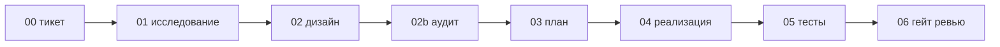

# tms-pipeline

**Опинионированный конвейер доставки для AI-агентов (Claude Code и Codex).**
Восемь стадий-скиллов проводят уже сформулированную задачу от тикета до проверенного кода — с
аудитом дизайна по шкале важности, экономической моделью запуска агентов и жёстким правилом: найденная
по пути работа не теряется.

🇬🇧 [Read in English](README.md) · 📖 [Полная методология](docs/00-methodology.ru.md) · 🚀 [Старт](docs/01-getting-started.ru.md)

---

## За 30 секунд

- **Что это.** Восемь стадий-скиллов, которые проводят **одну уже сформулированную** задачу от тикета до
  проверенного кода, держа контекст агента чистым на каждом шаге.
- **Чего нет.** Не генерирует проект, не придумывает фичи, не «делает продукт за вас».
- **Одна команда.** `npx tms-pipeline` настраивает методологию поверх вашего **существующего** репозитория.
- **Посмотреть вживую.** [Полный пример прогона задачи через все 8 стадий →](templates/example-task/ACME-101/)
  — синтетическая задача от `00_ticket.md` до `06_review_gate.md`, чтобы увидеть формат каждой стадии до запуска.

---

## Что это — и чем это НЕ является

**Это** методология *доставки*: дисциплинированный процесс, который проводит одну уже сформулированную
задачу от «нам нужно сделать X» до готового к слиянию проверенного кода, сохраняя контекст AI-агента
чистым на каждом шаге.

**Это НЕ:**

- ❌ генератор проектов — он не создаёт приложение с нуля;
- ❌ брейншторм фич — что именно строить, решаете вы, как привыкли; конвейер начинается, когда задача уже
  есть;
- ❌ волшебная кнопка «сделай мне продукт».

**Предусловия.** У вас уже должно быть: реальный репозиторий с кодом, документационная база (дерево
docs, вики, Obsidian-волт — где угодно, лишь бы это было постоянным местом знаний) и желательно бэклог
задач. Вложенные пустые болванки дают стартовую структуру, но наполнять их реальными продуктовыми
решениями — ваша работа.

---

## Ещё не начали проект? Сначала bootstrap

tms-pipeline рассчитывает, что у вас уже есть база документации и бэклог — он доставляет задачи, а не
придумывает продукт. Если вы стартуете с нуля, сделайте этот **разовый bootstrap**, чтобы дойти до
стартовой линии. Это ручной предварительный шаг, не стадия конвейера и не автоматический брейншторм —
ведёте его вы.

Откройте своего агента (Claude Code или Codex) в репозитории и используйте примерно такой промпт:

> Давай определим **MVP-документацию** продукта **<продукт>**. Идея в **<суть>**; цель — **<результат>**.
> Задавай мне вопросы **по одному**, каждый с 2–3 конкретными вариантами ответа, и **помечай
> рекомендованный вариант**. Я буду отвечать; когда вопросов не останется — сделай **начальный набор
> MVP-документации** — только то, что уже решено, с расчётом наполнять дальше по мере разработки.
> Разложи все решения из моих ответов по папкам шаблона документации tms-pipeline
> (`00 Governance/`, `02 Product/`, `03 Architecture/`, `04 Delivery/`) и держи всё **синхронным с моим
> vault документации** как единым источником правды.

Что это даёт:

- **Начальный набор MVP-документации**, заполненный вашими решениями, а не догадками агента. Это живой
  фундамент: вы наращиваете его по мере разработки, а не одноразовый документ.
- Вопросы **по одному с подсвеченным рекомендованным ответом** — можно быстро идти, принимая значения по
  умолчанию или возражая.
- Каждый результат **разложен по папкам шаблона док-базы** (сначала скопируйте
  `templates/docs-vault/PROJECT_NAME/` в свой vault — см. [docs/03-doc-base.ru.md](docs/03-doc-base.ru.md))
  и **синхронизирован с этим vault**, который становится единым источником правды.

Когда появятся этот базовый набор документации и хотя бы одна задача в бэклоге — запускайте
`npx tms-pipeline` и начинайте конвейер как обычно (ниже). Дальше vault продолжает расти: **после
выполнения каждой задачи её результат и решения вносятся обратно в нужные доки**, чтобы vault всегда
отражал то, что реально построено (см. [Documentation Discipline](docs/00-methodology.ru.md) и review-gate).

---

## Зачем это: контекстная инженерия

Универсальные промпты («сделай фичу, без багов») не масштабируются — единый мега-промпт наполняется
шумом, и результат деградирует в сложность, баги и уязвимости. Решение — **строгая декомпозиция**:
разбить работу на стадии и сделать результат каждой стадии узким, очищенным от шума контекстом для
следующей. На каждом шаге агент получает ровно то, что нужно, и ограничен стандартами вашего проекта.
Качество — из контроля контекста, а не из «магии модели».

→ Полное обоснование: [docs/00-methodology.ru.md](docs/00-methodology.ru.md).

---

## Восемь стадий

```
00_ticket → 01_research → 02_design → 02b_gap_audit → 03_delivery_plan → 04_implementation → 05_test_report → 06_review_gate
```



Каждая стадия создаёт один документ в папке задачи и по умолчанию останавливается для вашего
подтверждения перед следующей. Стадии брейншторма/идеации **нет** — конвейер стартует, когда задача уже
есть.

| Стадия | Скилл | Что делает |
|--------|-------|-----------|
| 00 Тикет | `/tms-ticket` | Драйвер, рамки, критерии приёмки; подтверждение задачи; режим задачи. |
| 01 Исследование | `/tms-research` | Сужает кодовую базу до фактов («как есть») через ограниченный параллельный поиск. |
| 02 Дизайн | `/tms-design` | Единый контракт дизайна — минимальное достаточное изменение, ревью до кода. |
| 02b Аудит пробелов | `/tms-gap-audit` | Один ограниченный состязательный проход по дизайну, со шкалой важности. |
| 03 План | `/tms-plan` | Разбивает на небольшие отгружаемые «волны»; каждой — профиль эскорта. |
| 04 Реализация | `/tms-implement` | Мульти-агентный «mob»: лид + рабочие/проверяющие агенты, гейты по волнам. |
| 05 Тесты | `/tms-test` | Проверка главного (видимого пользователю) сигнала + вторичных. |
| 06 Гейт ревью | `/tms-review` | Сверка с контрактом дизайна; go / conditional_go / no-go. |

Плюс дополнительные скиллы для работы с кодовой базой: четырёхстадийный **аудит**
(`/tms-audit-scope` → `sweep` → `triage` → `backlog`), поддерживающий **рефакторинг**
(`/tms-care-refactoring`, `/tms-ui-refactoring`) и итеративный **цикл ревью** (`/tms-loop-code-review`).

---

## Три вещи, которых нет у большинства агентных конвейеров

1. **Аудит дизайна по шкале важности.** До написания кода дизайн проверяется под *другим* углом мышления,
   чем тот, под которым он писался, и каждый пробел классифицируется A/B/C/D с явными правилами против
   раздувания и критериями остановки. Неверный дизайн правится в тексте, а не в коде.
2. **Экономическая модель агентов — профили эскорта.** Каждая волна реализации классифицируется как
   A (минимум: Dev+Tester+Reviewer), B (+Архитектор) или C (+Безопасность). Полный эскорт — только для
   действительно рискованных поверхностей (авторизация, мультиарендность, платежи, персональные данные…),
   которые *вы* задаёте. Тяжёлое ревью — только там, где оно окупается; «включить всё на всякий случай»
   прямо не приветствуется.
3. **Найденное не теряется.** Follow-up, расхождения документации и ручные пред-запусковые действия
   фиксируются по жёсткому правилу с таблицей маршрутизации (бэклог / документ-первоисточник / плейбук
   запуска / ADR), а бэклог держится в порядке принципом «объединять, не дробить».

→ Подробности: [docs/00-methodology.ru.md](docs/00-methodology.ru.md).

## Процесс соразмерен задаче

Тяжёлые конвейеры склонны топить однострочное изменение в церемониях. tms-pipeline сначала классифицирует
задачу — **Direct** (косметика), **Investigation** (причина неясна) или **TDD-first** (реальное
поведение), — так что вся машинерия включается только для существенной работы.

---

## Два способа внедрить

| | Turnkey (под ключ) | Methodology (метод) |
|---|---|---|
| Для кого | Быстро запуститься | Понять и настроить руками |
| Как | Мастер `npx tms-pipeline` + `/plugin install` | Прочитать доки, поставить скиллы, написать `AGENTS.md` самому |

Оба бесплатные, open-source, делят одно ядро.

---

## Установка

Скиллы и методология работают и в **Claude Code, и в Codex**. Мастер онбординга спрашивает, какой
инструмент(ы) вы используете, и пишет только нужное (например, не создаёт `.claude/CLAUDE.md`, если вы
используете только Codex).

```bash
# 1) Настроить методологию НА ВАШ существующий проект (короткий мастер y/n; спросит про Claude/Codex)
npx tms-pipeline
```

```text
# 2a) Claude Code — поставить скиллы + агентов
/plugin marketplace add TmsNine/tms-pipeline
/plugin install tms-pipeline@tms-pipeline
/reload-plugins

# 2b) Codex — читает AGENTS.md нативно. У Codex нет аналога /plugin install, поэтому скиллы/агентов
#     кладут в ~/.codex. Мастер `npx tms-pipeline` предложит скопировать их автоматически, если вы
#     выбрали Codex. Вручную:
#       cp -R skills/* ~/.codex/skills/ && cp -R agents/* ~/.codex/agents/
#     Подробнее — docs/02-configuration.ru.md#codex
```

> Мастер ставит только то, что вы выбрали: ответили «нет» на Claude Code — `.claude/CLAUDE.md` не
> создаётся; ответили «нет» на Codex — `~/.codex` не трогается.

---

## Туториал — как этим реально пользоваться

### Шаг 1 — Онбординг проекта

Запустите `npx tms-pipeline` (или `/tms-init` внутри Claude Code) и ответьте на короткий список вопросов
(Enter принимает значение по умолчанию). Мастер запишет заполненные `AGENTS.md` и `.claude/CLAUDE.md` в
ваш проект и может скопировать болванки пайплайна и док-базы.

### Шаг 2 — Разовая настройка

Откройте сгенерированный `AGENTS.md` и:

- закройте метки `<<TODO: ...>>` — в первую очередь **`PROFILE_C_TRIGGERS`** (какие поверхности требуют
  полного эскорта безопасности) и вашу модель арендности/идентичности;
- если копировали болванки док-базы — **переименуйте папку `PROJECT_NAME`** в имя вашего проекта и
  пропишите путь в `DOC_BASE_PATH`.

→ Справочник: [docs/02-configuration.ru.md](docs/02-configuration.ru.md).

### Шаг 3 — Прогнать одну задачу через конвейер

Возьмите задачу из бэклога и пройдите стадии. Агент делает одну стадию и останавливается для вашего «ок»:

```text
/tms-ticket    ACME-123     → пишет 00_ticket.md    (драйвер, рамки, приёмка, режим задачи)
/tms-research  ACME-123     → пишет 01_research.md   (факты; может задать интервью)
/tms-design    ACME-123     → пишет 02_design.md     (контракт дизайна — вы его ревьюите)
/tms-gap-audit ACME-123     → пишет 02b_gap_audit.md (пробелы A/B/C/D; Class A правится в дизайн)
/tms-plan      ACME-123     → пишет 03_delivery_plan.md (волны + профили эскорта)
/tms-implement ACME-123     → пишет 04_implementation.md (мульти-агентный mob, гейты по волнам)
/tms-test      ACME-123     → пишет 05_test_report.md (главный + вторичные сигналы)
/tms-review    ACME-123     → пишет 06_review_gate.md (go / conditional_go / no-go)
```

После каждой стадии в папке задачи (`docs/ACME-123/`) появляется файл. Прочитайте, подтвердите или
поправьте, затем запускайте следующую стадию.

> **Начинайте каждую стадию в чистом контекстном окне.** В этом и весь смысл контекстной инженерии:
> следующая стадия должна получить только артефакт предыдущей, а не накопленный шум переписки. Каждый
> скилл-стадия в конце напоминает об этом. Перед запуском следующей стадии:
> **Claude Code** → `/clear`; **Codex** → `/clear` (или `/new`). Затем запускайте следующую команду `/tms-*`.

Просите агента «прогони до конца» только для мелких задач, где держать один контекст дешевле, чем выигрыш
от очистки.

### Шаг 4 — Куда что попадает

- Изменения кода: в вашем репозитории, в коммите (без AI-авторства, без авто-пуша — ветка ждёт ревью/CI).
- Follow-up: новые строки бэклога (объединённые в бандлы).
- Ручные шаги запуска: ваш плейбук запуска.

### FAQ

- **Нужны ли и Claude Code, и Codex?** Нет — работает любой. Скиллы переносимы; Codex читает `AGENTS.md`
  нативно.
- **Можно пропускать стадии?** Для мелких задач — да: режим задачи (Direct/Investigation) урезает процесс,
  а аудит можно отметить «skipped per minimal-surface exception».
- **Дизайн получился неверным — что делать?** В этом и смысл стадии 02/02b: поправить в тексте и
  перезапустить. Это дёшево, пока кода ещё нет.
- **Он придумает фичи за меня?** Нет. Принесите свою задачу — конвейер её доставит.

---

## Структура репозитория

```
skills/        15 скиллов tms-* (конвейер + аудит + рефакторинг)
agents/        5 mob-ролей (разработчик, тестировщик, архитектор, безопасность, ревьюер)
commands/      команда онбординга /tms-init
installer/     ядро движка настройки + мастер `npx tms-pipeline`
templates/     шаблоны AGENTS/CLAUDE, формы пайплайна, болванки док-базы
docs/          полная методология + старт + конфигурация + док-база
```

---

## Источники и благодарности

Проект синтезирует и развивает работы других авторов:

- **Базовая методология работы над одной задачей** — адаптирована из видео
  [«Почему AI генерит мусор — и как заставить его писать нормальный код»](https://youtu.be/7oRBHxMvWxQ)
  автора **Дмитрия Березницкого**, где изложен подход контекстной инженерии и четырёхфазный процесс
  (исследование → дизайн → планирование → реализация) с mob-программированием и quality gates.
- **Четырёхстадийный аудит кодовой базы** (`/tms-audit-scope` → `sweep` → `triage` → `backlog`) —
  адаптирован из идей [di.sukharev](https://www.instagram.com/di.sukharev/) и оформлен здесь в скиллы.
- **Канон `AGENTS.md`** — отдельные части опираются на формат и соглашения `AGENTS.md` от **Boris Cherny**.

Всё остальное (расширение до восьми стадий, аудит дизайна по шкале важности, профили эскорта, захват
follow-up/launch-действий и сама упаковка) — оригинальная разработка этого проекта.

## Лицензия

[Apache-2.0](LICENSE). Свободно использовать и адаптировать. Относитесь к методологии как к живому
процессу — меняйте названия стадий, триггеры эскорта и промпты под культуру вашей команды; важен принцип:
контролировать контекст на каждом шаге.
