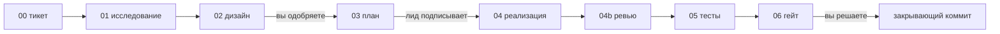

```text
████████╗███╗   ███╗███████╗
╚══██╔══╝████╗ ████║██╔════╝
   ██║   ██╔████╔██║███████╗
   ██║   ██║╚██╔╝██║╚════██║
   ██║   ██║ ╚═╝ ██║███████║
   ╚═╝   ╚═╝     ╚═╝╚══════╝
```

# tms-pipeline

**tms-pipeline — это дисциплина для AI-агентов: она проводит одну уже поставленную задачу от тикета до проверенного кода, держа память агента чистой на каждом шаге.**
Работа разбита на восемь стадий. Каждая стадия идёт в свежем контексте и оставляет после себя один документ
(каждая стадия — это *скилл*, команда агенту, например `/tms-01-research`). Ещё один скилл, `/tms-run`, сам
проводит задачу через все восемь стадий. Конвейер останавливается ради вас дважды — после дизайна и на
финальном гейте — и никогда не решает за вас (это и есть принцип «человек в контуре», human in the loop).

🇬🇧 [Read in English](README.md) · 📖 [Полная методология](docs/00-methodology.ru.md) · 🚀 [Старт](docs/01-getting-started.ru.md) · 🧭 [Маршрутизатор моделей](docs/06-model-routing.ru.md)

---

## Если коротко

- **Что это.** Процесс из восьми стадий, который ведёт **одну уже сформулированную** задачу от тикета до
  проверенного кода. Главная идея — на каждой стадии у агента в работе только то, что нужно именно сейчас.
  (У агента ограниченная рабочая память — *контекстное окно*; чем больше в ней лишнего, тем хуже ответ.)
- **Основная работа — думание на бумаге.** Каждая стадия оставляет текстовый документ (`.md`). Код пишется
  только на стадии 04, после того как дизайн одобрен, а план подписан. Ошибки ловятся в тексте, где их
  исправление стоит одной фразы.
- **Вы решаете в двух точках.** Вы читаете и одобряете **дизайн** (стадия 02) и принимаете **итоговое
  решение** на гейте (стадия 06). Между ними агенты работают сами: план проверяет свежий читатель и
  подписывает ведущий агент, код проверяют независимые ревьюеры, которые не видели переписку автора.
  Молчание никогда не считается согласием.
- **Чего нет.** Не генерирует продукт, не придумывает фичи за вас, не «волшебная кнопка».
- **Одна команда.** `npx tms-pipeline` настраивает процесс поверх вашего **существующего** репозитория.
- **Посмотреть вживую.** [Полный пример прогона задачи через все восемь стадий →](templates/example-task/ACME-101/)
  — синтетическая задача от `00_ticket.md` до `06_review_gate.md`, чтобы увидеть формат каждой стадии до запуска.
- **Что под капотом.** [Как устроена каждая стадия: какие агенты, на каких моделях и зачем →](docs/04-stages-deep-dive.ru.md)

---

## Что это — и чем это НЕ является

**Это** процесс доведения одной задачи до готового кода: он берёт уже сформулированную задачу («нам нужно
сделать X») и проводит её до проверенного кода, который можно вливать в основную ветку, сохраняя рабочую
память (контекст) AI-агента чистой на каждом шаге.

**Это НЕ:**

- ❌ генератор проектов — он не создаёт приложение с нуля;
- ❌ брейншторм фич — что именно строить, решаете вы, как привыкли; процесс начинается, когда задача уже
  есть;
- ❌ волшебная кнопка «сделай мне продукт».

**Предусловия.** У вас уже должно быть: реальный репозиторий с кодом, база документации (дерево docs,
вики или Obsidian-vault — где угодно, лишь бы это было постоянным местом, где живут знания о продукте) и
желательно бэклог — список задач на будущее. Готовые пустые заготовки дают стартовую структуру, но
наполнять их реальными продуктовыми решениями — ваша работа.

---

## Ещё нет базы документации? Сначала разовая подготовка

tms-pipeline рассчитывает, что у вас уже есть база документации и хотя бы одна задача в бэклоге — он
доводит до кода уже поставленные задачи, а не придумывает продукт. Если вы стартуете с нуля, сделайте эту
**разовую первичную подготовку**, чтобы дойти до стартовой линии. Это разовый шаг, а не одна из восьми
стадий процесса и не автоматический брейншторм: продукт определяете вы, агент лишь задаёт вопросы и
раскладывает ваши ответы по документам.

Как понять, нужен ли этот шаг: **базы документации и задач ещё нет → делайте подготовку (ниже). Они уже
есть → пропускайте этот раздел** и сразу переходите к установке.

Самый простой путь — скилл **`/tms-new`** (напомним: *скилл* — это команда вида `/tms-new`, которую вы
даёте агенту). Он проводит эту подготовку за вас в формате интервью (вопросы по одному, с рекомендованным
вариантом), а в конце создаёт стартовый набор документов и структуру папок. Предпочитаете руками —
используйте промпт ниже:

> Давай определим **MVP-документацию** продукта **<продукт>**. Идея в **<суть>**; цель — **<результат>**.
> Задавай мне вопросы **по одному**, каждый с 2–3 конкретными вариантами ответа, и **помечай
> рекомендованный вариант**. Я буду отвечать; когда вопросов не останется — сделай **начальный набор
> MVP-документации** — только то, что уже решено, с расчётом наполнять дальше по мере разработки.
> Разложи все решения из моих ответов по папкам шаблона документации tms-pipeline
> (`00 Governance/`, `02 Product/`, `03 Architecture/`, `04 Delivery/`) и держи всю кодовую базу и
> документацию **синхронными с моей vault-документацией** как единым источником правды.

Что это даёт:

- **Начальный набор MVP-документации**, заполненный вашими решениями, а не догадками агента. Это живой
  фундамент: вы наращиваете его по мере разработки, а не одноразовый документ.
- Вопросы **по одному с подсвеченным рекомендованным ответом** — можно быстро идти, принимая значения по
  умолчанию или возражая.
- Каждый результат **разложен по папкам шаблона базы документации** (сначала скопируйте
  `templates/docs-vault/PROJECT_NAME/` в свою базу документации — см.
  [docs/03-doc-base.ru.md](docs/03-doc-base.ru.md)) и **синхронизирован с ней**. Эта база становится
  главным документом, с которым потом сверяют всё остальное.

Когда появится этот базовый набор документации и хотя бы одна задача в бэклоге — запускайте
`npx tms-pipeline` и начинайте процесс как обычно (ниже). Дальше база документации продолжает расти:
**после выполнения каждой задачи её результат и решения вносятся обратно в нужные документы**, чтобы база
всегда отражала то, что реально построено (см. [Documentation Discipline](docs/00-methodology.ru.md) и
review-gate).

---

## Зачем это: контроль контекста

Универсальные промпты («сделай фичу, без багов») не масштабируются. Когда в один промпт свалено всё —
описание, история переписки, требования, прошлые попытки, — агент путается, теряет ранние инструкции и
выдаёт код с ошибками. Чем больше лишнего в его рабочей памяти (контексте), тем хуже результат.

Решение — **разбить работу на шаги** и сделать так, чтобы результат каждого шага был узким, очищенным от
лишнего входом для следующего. На каждом шаге агент получает ровно то, что нужно, и ограничен стандартами
вашего проекта. Качество зависит от того, насколько чистый контекст получает агент на каждом шаге.

→ Полное обоснование: [docs/00-methodology.ru.md](docs/00-methodology.ru.md).

---

## Восемь стадий

```
00_ticket → 01_research → 02_design → 03_plan → 04_implementation → 04b_review → 05_test_report → 06_review_gate
```


```mermaid
flowchart LR
  T["00 тикет"] --> R["01 исследование"] --> D["02 дизайн"]
  D -->|"вы одобряете"| P["03 план"]
  P -->|"лид подписывает"| I["04 реализация"] --> L["04b ревью"] --> TE["05 тесты"] --> G["06 гейт"]
  G -->|"вы решаете"| Done["закрывающий коммит"]
```

Каждая стадия создаёт один документ в папке задачи (`docs/<TASK-ID>/`) и идёт в **свежем контексте**: она
получает предыдущие документы, но никогда — предыдущую переписку. Стадия, унаследовавшая рассуждения
предыдущей, наследует и её слепые пятна, — поэтому это единственное правило, которое процесс охраняет
жёстче всего. Стадии брейншторма **нет** — процесс начинается, когда задача уже есть.

| Стадия | Скилл | Что делает | Кто останавливает |
|--------|-------|------------|-------------------|
| 00 Тикет | `/tms-00-ticket` | Записывает проблему одной фразой со стороны пользователя, кого она касается и что в задачу не входит. Решение, что задача существует, — только за вами. | — |
| 01 Исследование | `/tms-01-research` | Собирает факты с точными файлами и строками, без мнений. Отделяет «проверено — отсутствует» от «не найдено поиском», перечисляемое выписывает по строке на элемент. | — |
| 02 Дизайн | `/tms-02-design` | Выбирает решение: слой-владелец поведения, «было → стало» глазами пользователя, тест на каждое поведение, откат. Если два варианта меняют то, что видят пользователи, сначала задаёт вам один вопрос. | **Вы читаете и одобряете** |
| 03 План | `/tms-03-plan` | Режет работу на маленькие фазы с точным списком файлов (File Ownership — вне его ничего не пишется), картой швов между фазами, запускаемой проверкой на каждую фазу и точной спецификацией падающего теста. Свежий читатель сверяет план сам с собой. | Подписывает ведущий агент |
| 04 Реализация | `/tms-04-implement` | Один агент пишет весь план — тест первым, фаза за фазой, — а в конце проверяет каждый шов насквозь. Если изменение касается безопасности, денег, арендаторов или персональных данных, один проверяющий по безопасности смотрит всё изменение целиком. | — |
| 04b Ревью | `/tms-04b-review` | До пяти свежих независимых ревьюеров по очереди; один из них всегда доказывает, что весь путь работает насквозь. Блокирует только реальный дефект, заметный пользователю; остальные находки исправляются, предлагаются в бэклог, откладываются с названным триггером или отбрасываются с причиной. | — |
| 05 Тесты | `/tms-05-test` | Прогоняет каждую проверку из плана и пишет, что каждая вернула, — сначала сигнал, видимый пользователю, потом проверки кода, и что не запускалось. | — |
| 06 Гейт | `/tms-06-gate` | Одна страница для решения: доказательство, что задача работает, приёмка построчно, что сделало ревью, что осталось человеку. **`go` пишете только вы.** Ведущий агент может подписать `conditional_go`, когда осталась лишь живая проверка или шаг выката. | **Вы решаете** |

→ Что именно происходит на каждой стадии (какие агенты, на каких моделях, где ваша проверка) — в
[разборе стадий «под капотом»](docs/04-stages-deep-dive.ru.md).

Плюс дополнительные скиллы: **`/tms-run`** (оркестратор — проводит одну задачу через все восемь стадий и
останавливается в ваших двух точках), **`/tms-ui-screen`** (один экран через переиспользование
дизайн-системы, интерактивную проверку, ревью и ваше визуальное утверждение — задача, меняющая экран,
идёт через него вместо стадии 04), четырёхшаговый **аудит** кодовой базы (`/tms-audit-scope` → `sweep` →
`triage` → `backlog`), поддерживающий **рефакторинг** (`/tms-care-refactoring`, `/tms-ui-refactoring`) и
**`/tms-new`** для продукта, который начинается с нуля.

---

## Чего нет у большинства агентных процессов

1. **Свежий контекст на каждую стадию и поручения без мнений.** Оркестратор передаёт стадии пути к входным
   документам и ваши точные слова — но никогда не свою версию проблемы. Агент, которому вручили гипотезу,
   возвращает её подтверждённой; свежий — проверяет.
2. **Один автор кода, независимые глаза на ревью.** Если одну цепочку работы разрезать между многими
   агентами, теряется то, что живёт между кусками, а координация стоит дороже самой работы. Поэтому весь
   план пишет один агент, а независимость стоит там, где она нужна: ревьюеры, не видевшие переписку автора,
   проверка безопасности при реальном триггере и сквозной проход, который обязан доказать, что функция
   действительно доходит до пользователя.
3. **Ревью, которое заканчивается.** Ревьюер всегда найдёт ещё один крайний случай. Здесь находка блокирует,
   только если её можно воспроизвести на текущем коде **и** пользователь это заметит; у всего остального
   есть маршрут — исправить сразу, одна строка в бэклог на ваше «да/нет», запись в реестр триггеров
   («важно, когда случится X») или отказ с причиной. Не больше пяти проходов, и цикл останавливается раньше,
   если застопорился.
4. **Ничего найденного не теряется.** Отложенные пункты, расхождения с документацией и ручные шаги перед
   запуском фиксируются по жёсткому правилу: в бэклог, в исходный документ или в плейбук запуска (список
   ручных шагов перед выкатом). А сам бэклог держится в порядке правилом «группируй находки, не дроби».
5. **Модель и усилие закреплены за ролью.** Каждая роль агента сама объявляет свою модель и уровень
   рассуждения, поэтому модели руками не переключаются: глубокое суждение (дизайн, ревью, безопасность) — на
   самой сильной модели с высоким усилием, рутинная сборка и поиск — на более дешёвой.

→ Подробнее: [docs/00-methodology.ru.md](docs/00-methodology.ru.md) · [docs/06-model-routing.ru.md](docs/06-model-routing.ru.md).

## Процесс соразмерен задаче

В тяжёлых процессах однострочное изменение обрастает ненужными формальностями. Здесь агент сначала
определяет режим задачи — **Direct** (косметика, мелкая правка), **Investigation** (причина проблемы пока
неясна) или **TDD-first** (меняется реальное поведение, поэтому сначала пишут падающий тест, а потом код,
пока тест не станет зелёным). Все стадии при этом идут всегда — даже однострочная правка получает дизайн, —
но **разделы фиксированы, а длина свободна**: «Контракт: не меняется» — полный ответ. Дополнительная
проверка безопасности и более тяжёлое ревью включаются только при реальном триггере.

---

## Два способа подключить

Результат одинаковый — разница лишь в том, сколько вы делаете руками.

- **Под ключ — большинству подойдёт это.** Запускаете `npx tms-pipeline` (это терминальная программа, не
  агент): он ставит скиллы и кладёт стартовый `AGENTS.md`, а затем `/tms-init` внутри вашего агента читает
  репозиторий и заполняет его. `AGENTS.md` — это файл с настройками вашего проекта,
  который агенты читают, чтобы знать ваши правила. Берите этот путь, если хотите начать работать сегодня и
  не вникать в устройство.
- **Вручную — если хочется контроля.** Читаете методологию, ставите скиллы и пишете `AGENTS.md` сами.
  Берите этот путь, если хотите понять каждую деталь и подстроить процесс под свою команду.

---

## Установка

Claude Code и Codex — это два AI-инструмента (программы, в которых работают агенты). Скиллы и весь процесс
работают в обоих; вам нужен только один из двух. Мастер-установщик спрашивает, какой инструмент(ы) вы
используете, и пишет только нужное (например, не создаёт `.claude/CLAUDE.md`, если вы используете только
Codex).

```bash
# 1) Настроить процесс НА ВАШ существующий проект (короткий мастер y/n; спросит про Claude/Codex)
npx tms-pipeline

#    Пока пакет не опубликован в npm, запускайте прямо с GitHub:
npx github:TmsNine/tms-pipeline

#    Посмотреть, что будет сделано, ничего не записывая:   npx tms-pipeline --dry-run
```

```text
# 2a) Claude Code — поставить скиллы + агентов. Два способа, выберите ОДИН (чтобы не было дублей).
#   (а) через маркетплейс плагинов:
/plugin marketplace add TmsNine/tms-pipeline
/plugin install tms-pipeline@tms-pipeline
/reload-plugins
#   (б) или пусть мастер скопирует их: ответьте «да» на «Install the tms-* skill files now»
#       → skills/agents/commands лягут в ~/.claude, затем перезапустите Claude Code.

# 2b) Codex — читает AGENTS.md нативно. У Codex нет аналога /plugin install, поэтому скиллы/агентов
#     кладут в ~/.codex. Мастер копирует их, если вы выбрали Codex. Вручную:
#       cp -R codex-skills/* ~/.codex/skills/ && cp -R codex-agents/* ~/.codex/agents/
#     Подробнее — docs/02-configuration.ru.md#codex
```

> Мастер ставит только то, что вы выбрали, и никогда не перезаписывает существующий файл без `--force`.
> **Обновляетесь с 0.1.x?** Мастер также ничего не удаляет, поэтому выведенные из оборота папки скиллов
> (`tms-ticket`, `tms-research`, `tms-design`, `tms-gap-audit`, `tms-plan`, `tms-implement`,
> `tms-loop-review`, `tms-loop-code-review`, `tms-review`, `tms-test`, а в Codex — `tms-02b-gap-audit`,
> `tms-04b-loop-review`, `tms-06-review`, `tms-94-loop-code-review`) удалите из `~/.claude/skills` и
> `~/.codex/skills` вручную — см. [CHANGELOG.md](CHANGELOG.md).

---

## Туториал — как этим реально пользоваться

### Шаг 1 — Онбординг проекта

Запустите `npx tms-pipeline`, затем `/tms-init` внутри Claude Code или Codex. Мастер кладёт стартовый
`AGENTS.md` (файл с настройками вашего проекта, который агенты читают, чтобы знать ваши правила);
`/tms-init` читает ваш репозиторий и заполняет его — команды тестов и сборки, пути, формат тикета, —
спрашивая только то, чего не смог найти сам.

### Шаг 2 — Разовая настройка

Откройте созданный `AGENTS.md` и закройте оставшиеся метки `<<TODO: ...>>` — в первую очередь:

- **`SECURITY_TRIGGERS`** — какие участки кода (вход, роли, данные арендаторов, деньги, персональные данные)
  включают проверку безопасности на стадии 04 и самого сильного ревьюера на 04b;
- **`TASK_CHECK_CMD`** — одна команда, которая собирает, проверяет типы и тестирует всё, что задела задача;
- **реестр известного долга тестов** (тесты, которые уже красные в основной ветке) и **реестр триггеров**
  (находки, важные только когда случится названное событие);
- если копировали пустые заготовки базы документации — **переименуйте папку `PROJECT_NAME`** и пропишите
  путь в `DOC_BASE_PATH`.

> **Не знаете, что писать в `<<TODO>>`?** Не угадывайте в одиночку: попросите своего AI-агента прочитать
> ваш код и предложить значения, а вы их подтвердите или поправьте — в
> [docs/05-manual-setup.ru.md](docs/05-manual-setup.ru.md) есть готовые промпты.

→ Справочник: [docs/02-configuration.ru.md](docs/02-configuration.ru.md).

### Шаг 3 — Прогнать одну задачу через процесс

Самый простой путь — отдать задачу оркестратору.

```text
/tms-run ACME-123
```

Он запускает каждую стадию отдельным агентом со свежим контекстом и останавливается дважды:

1. **После `02_design.md`** — прочитайте дизайн и одобрите его (или попросите поправить). Если какой-то
   выбор меняет то, что видят пользователи, вы ещё до готового дизайна получите один вопрос простыми
   словами с рекомендованным ответом.
2. **На `06_review_gate.md`** — прочитайте одну страницу и решите: `go`, «сначала чиним» или «не сейчас».
   Если осталась только живая проверка или шаг выката, ведущий агент подписывает `conditional_go` и
   записывает этот шаг в ваш плейбук запуска.

Хотите вести вручную? Запускайте стадии по одной, каждую в чистом контекстном окне (**Claude Code** →
`/clear`; **Codex** → `/clear` или `/new` перед следующей командой):

```text
/tms-00-ticket     ACME-123  → 00_ticket.md          (проблема, кого касается, что не входит)
/tms-01-research   ACME-123  → 01_research.md        (только факты)
/tms-02-design     ACME-123  → 02_design.md          (вы одобряете)
/tms-03-plan       ACME-123  → 03_plan.md            (фазы, File Ownership, проверки — подписывает лид)
/tms-04-implement  ACME-123  → 04_implementation.md  (код, тест первым)
/tms-04b-review    ACME-123  → 04b_review.md         (независимый цикл ревью)
/tms-05-test       ACME-123  → 05_test_report.md     (каждая проверка с кодом возврата)
/tms-06-gate       ACME-123  → 06_review_gate.md     (вы решаете)
```

### Шаг 4 — Куда что попадает

- Изменения кода: в вашем репозитории, одним закрывающим коммитом на задачу после гейта (без указания AI
  как автора, без автоматической отправки на сервер).
- Отложенные пункты, которые вы одобрили на гейте: новые строки бэклога, объединённые в группы.
- Находки, важные только позже: реестр триггеров.
- Ручные шаги перед запуском и условия `conditional_go`: ваш плейбук запуска.

### FAQ

- **Нужны ли и Claude Code, и Codex?** Нет — работает любой. Скиллы переносимы; Codex читает `AGENTS.md`
  нативно.
- **Можно пропускать стадии?** Нет — каждая задача проходит все восемь, но маленькая задача заполняет
  каждую в несколько строк. Разделы фиксированы, длина свободна.
- **Дизайн получился неверным — что делать?** Скажите об этом на остановке после дизайна. Правка попадает в
  документ дизайна, и план пишется уже по исправленной версии. Это дёшево, пока кода ещё нет.
- **А если агенту нужно тронуть файл, которого нет в плане?** Он остановится и спросит вас. File Ownership —
  граница реализации.
- **Он придумает фичи за меня?** Нет. Принесите свою задачу — процесс доведёт её до кода.

---

## Структура репозитория

```
skills/        скиллы tms-* для Claude Code (8 стадий + tms-run + tms-ui-screen + аудит + рефакторинг + tms-new)
codex-skills/  скиллы tms-* для Codex (те же стадии; аудит и рефакторинг — под номерными именами)
agents/        9 ролей-агентов Claude Code, у каждой закреплены модель и усилие
codex-agents/  6 TOML-ролей Codex
commands/      команда онбординга /tms-init
installer/     ядро движка настройки + мастер-установщик `npx tms-pipeline`
templates/     шаблоны AGENTS/CLAUDE, формы документов стадий, пустые заготовки базы документации, пример задачи
docs/          методология + старт/конфигурация + разбор стадий + маршрутизация моделей
```

---

## Источники и благодарности

Проект синтезирует и развивает работы других авторов:

- **Базовая методология работы над одной задачей** — адаптирована из видео
  [«Почему AI генерит мусор — и как заставить его писать нормальный код»](https://youtu.be/7oRBHxMvWxQ)
  автора **Дмитрия Березницкого**, где изложен подход контроля контекста и четырёхфазный процесс
  (исследование → дизайн → планирование → реализация) с работой команды агентов (mob) и контрольными
  точками (quality gates), через которые работа не проходит дальше, пока все проверки не зелёные.
- **Четырёхшаговый аудит кодовой базы** (`/tms-audit-scope` → `sweep` → `triage` → `backlog`) —
  адаптирован из идей [di.sukharev](https://www.instagram.com/di.sukharev/) и оформлен здесь в скиллы.
- **Канон `AGENTS.md`** — отдельные части опираются на формат и соглашения `AGENTS.md` от **Boris Cherny**.

- **Цикл ревью 04b** — опирается на скилл `loop-code-review` от di-sukharev; вместо его вердикта и
  открытой остановки здесь контракт находки (блокирующая или с маршрутом).

Всё остальное (цепочка из восьми стадий с двумя остановками владельца, реализация одним исполнителем,
карта швов, маршруты находок, фиксация follow-up и ручных действий перед запуском, а также сама упаковка)
— оригинальная разработка этого проекта.

## Лицензия

[Apache-2.0](LICENSE). Свободно использовать и адаптировать. Относитесь к процессу как к живому — меняйте
названия стадий, триггеры безопасности и промпты под культуру вашей команды; важен принцип: контролировать контекст
на каждом шаге и ставить независимое ревью туда, где оно проверяет реальный результат.
