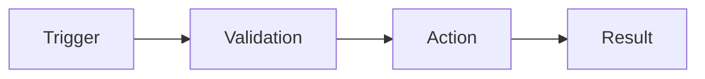

# Design: [TASK_NAME]

Date: [DATE]

## Inputs
- `01_research.md`
- [interview answers, if any]

## Solution (the single design contract)
[The minimal sufficient change at the owning layer. Be concrete.]

## Flow

## API / data
- New/changed endpoints or contracts: ...
- Schema/persistence changes: ...

## Change-surface triggers handled
[contracts producer+consumer, auth, async retries/idempotency, persistence read+write, legal/billing copy]

## Test strategy
- Unit: ...
- Integration: ...
- E2E / manual: ...

## Acceptance contract
- Primary signal (user-visible): ...
- Secondary signals (tests / typecheck / lint / build): ...

## Rollout order (if contracts / migrations / auth change)
- ...
