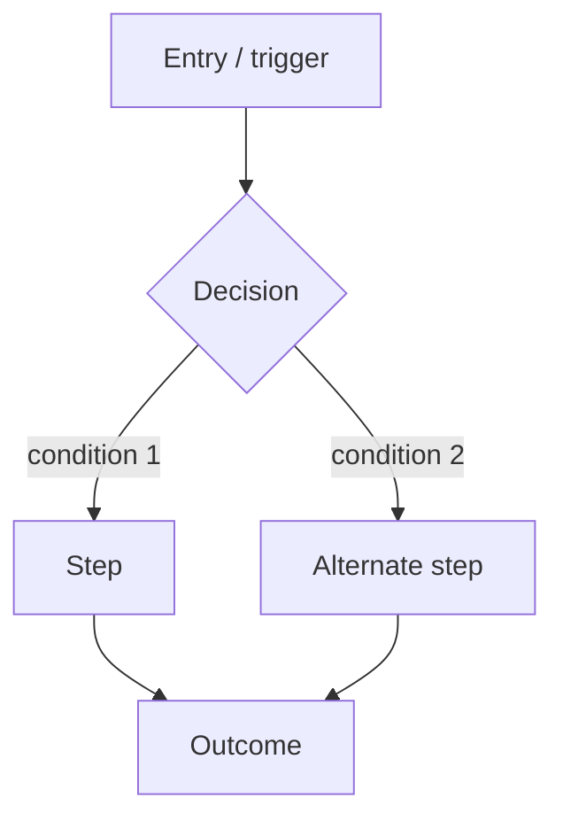

# Flow — <FLOW_NAME>

> Write the CONTENT in your project's output language. This is a skeleton — fill each section.

## Diagram

## Preconditions

- <what must be true before this flow can start>.

## Happy path

1. <step>.
2. <step>.
3. <successful outcome>.

## Edge cases

- <edge case> → <expected handling>.
- <edge case> → <expected handling>.

## States

- **Loading** — <what the user sees / what the system does while in progress>.
- **Empty** — <no data yet>.
- **Error** — <failure handling, recovery, messaging>.
- **Success** — <completed outcome>.
