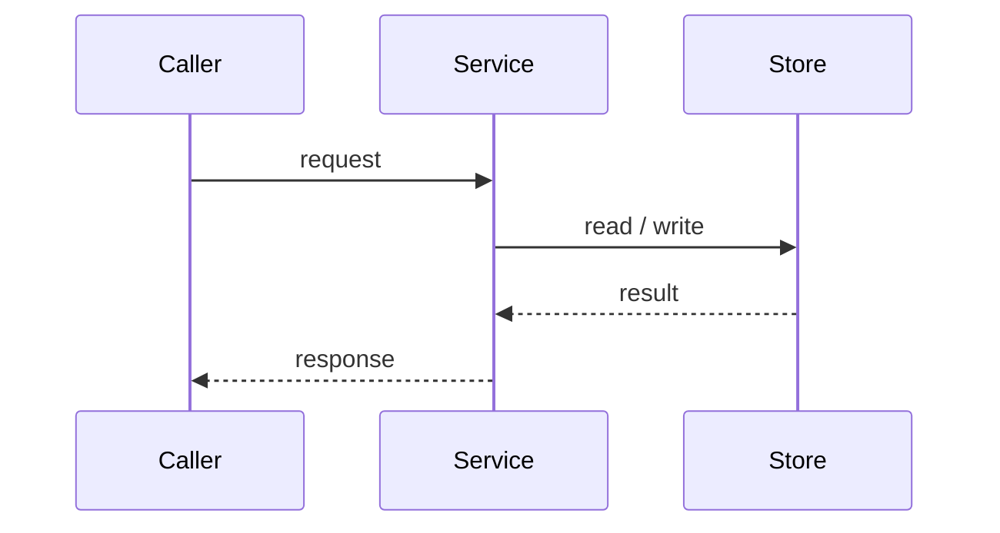

# Architecture Delta

> Write the CONTENT in your project's output language. This is a skeleton — fill each section.

## Context

What change is being made and why. Link the driving PRD / Flow.

## Components touched

- `<component / module / service>` — <how it changes>.
- `<component>` — <...>.

## Data model changes

- `<table / collection / entity>` — <new fields, constraints, indexes, migrations; additive and reversible where possible>.

## Sequence

## Decisions (ADR-style)

### ADR-1: <decision title>
- **Decision:** <what was decided>.
- **Rationale:** <why; alternatives considered>.
- **Risks:** <what could go wrong; mitigations>.

## Rollout / ordering

- <deploy / migration ordering constraints, feature flags, backfills, fallback plan>.
