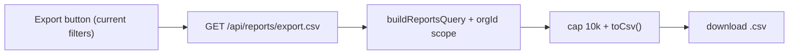

# Design: Export reports list to CSV

Date: 2026-01-15

## Inputs
- `01_research.md`; interview answer: export all matching rows, capped at 10,000.

## Solution (the single design contract)
Add a server-rendered CSV export that reuses the existing org-scoped query, so permissions and filters
cannot diverge from the table:

- New endpoint `GET /api/reports/export.csv?…filters` in `api/src/routes/reports.ts`. It reuses the same
  `buildReportsQuery(filters, req.user.orgId)` used by `listReports` (extract that into a shared helper so
  there is exactly one query definition), caps at 10,000 rows, and streams a CSV.
- CSV serialization via a small pure helper `api/src/lib/csv.ts` (`toCsv(rows, columns)`) that RFC-4180
  escapes commas, quotes, and newlines.
- Column set shared from one definition reused by both the table and the export.
- Frontend: a `Button` on `ReportsList.tsx` that links to the export URL with the current filters; disabled
  while filters are loading.

## Flow

## API / data
- New: `GET /api/reports/export.csv`. No schema changes.

## Change-surface triggers handled
- Producer+consumer: the filter contract is shared; the column order is shared (single source).
- Auth: export reuses the SAME org-scoping helper as the list — no second, divergent access path.

## Test strategy
- Unit: `toCsv()` escaping (comma, quote, newline, empty).
- Integration: export endpoint returns only the caller's org rows; respects filters; caps at 10k.
- E2E/manual: button downloads a CSV matching the filtered table.

## Acceptance contract
- Primary signal: clicking Export downloads a CSV of exactly the filtered, permitted rows.
- Secondary: unit + integration tests green, typecheck/lint/build green.

## Rollout order
- Pure additive (new endpoint + new button). No migration. Ship in one go.
